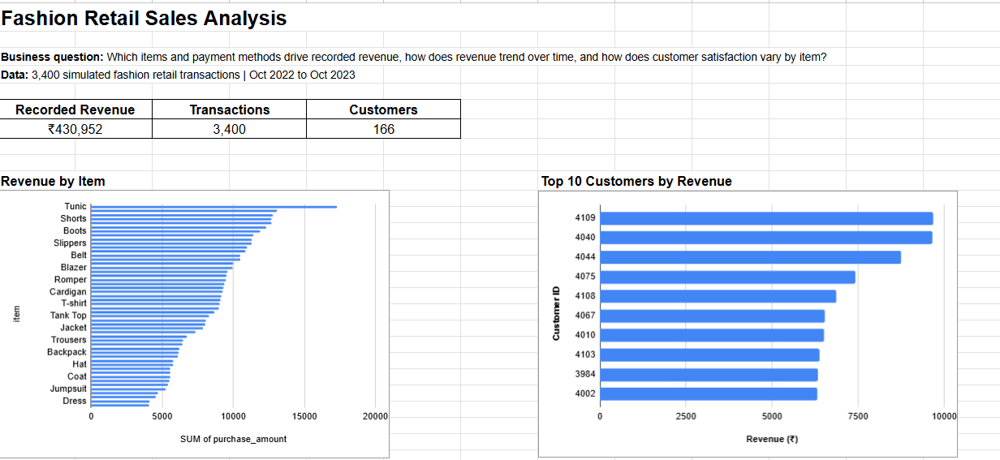
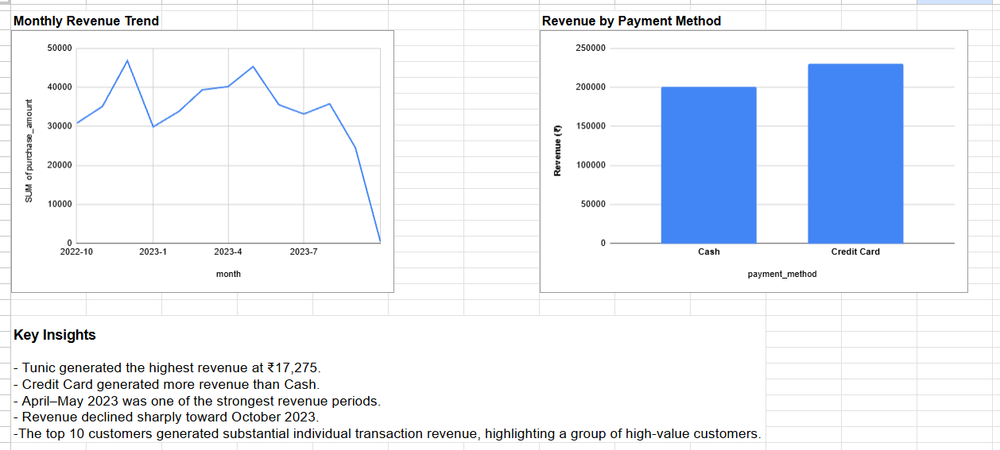

# Fashion Retail Sales Analysis

A retail sales analysis project built to understand product performance, revenue trends, customer value, payment-method performance, and customer satisfaction.

The project combines Python for data preparation and statistical analysis, MySQL for business analysis, and Google Sheets for the final dashboard.

> **Note:** The dataset is simulated and should not be interpreted as real-world business performance.

## Project Overview

The dataset contains **3,400 simulated fashion retail transactions** covering October 2022 to October 2023.

The main questions I wanted to answer were:

- Which products generate the most revenue?
- How does revenue change over time?
- Which payment method contributes more revenue?
- Who are the highest-value customers?
- Does customer satisfaction vary across products?
- Which price bands contribute most to revenue?
- Are observed differences in transaction value statistically significant?

## Dashboard

The final dashboard was built in Google Sheets and includes:

- KPI cards for revenue, transactions and customers
- Revenue by item
- Monthly revenue trend
- Revenue by payment method
- Top 10 customers by revenue
- Key business insights

### Dashboard Preview



### Full Dashboard



## Key Metrics

| Metric | Value |
|---|---:|
| Total Revenue | ₹430,952 |
| Transactions | 3,400 |
| Customers | 166 |
| Period | Oct 2022 to Oct 2023 |

## Tools Used

- **Python:** data cleaning, exploratory analysis, and statistical testing
- **Pandas & NumPy:** data manipulation and analysis
- **SciPy:** hypothesis testing and correlation analysis
- **MySQL:** data analysis and SQL querying
- **Google Sheets:** pivot tables, dashboard and visualizations
- **Git/GitHub:** version control and documentation

## Data Analysis Workflow

The project follows an end-to-end analytical workflow:

1. Clean and prepare the raw dataset using Python
2. Perform exploratory data analysis
3. Load the cleaned dataset into MySQL
4. Answer business questions using SQL
5. Perform statistical analysis to test observed relationships and differences
6. Build a dashboard in Google Sheets
7. Document the findings and analytical decisions

## SQL Analysis

The SQL analysis includes:

- Aggregations with `SUM()`, `COUNT()`, `AVG()`, `MIN()` and `MAX()`
- `GROUP BY` and `HAVING`
- Common Table Expressions (CTEs)
- Window functions such as `SUM() OVER()` and `RANK()`
- Customer revenue segmentation using `CASE`
- Revenue-share calculations
- Monthly and quarterly trend analysis
- Data-quality checks

The main SQL queries are available in:

```text
sql/analysis_queries.sql
```

## Statistical Analysis

Statistical analysis was performed in Python to determine whether observed patterns in the dataset were statistically significant.

### Descriptive Statistics

Purchase amounts were highly right-skewed, with a mean of $156.71, median of $110.00, and skewness of 8.497. This indicates that a relatively small number of high-value transactions substantially influenced the average.

Review ratings had a mean and median of approximately 3.0, with near-zero skewness (-0.015), indicating an approximately symmetric distribution.

### Rating vs Purchase Amount

Pearson correlation was used to examine the relationship between customer review rating and purchase amount.

- Pearson correlation: r = 0.0451
- p-value: 0.0244

The correlation was statistically significant at the 5% level, but the relationship was extremely weak. Therefore, the result has limited practical significance and should not be interpreted as evidence that higher ratings cause higher transaction values.

### Credit Card vs Cash Order Value

Welch's independent-samples t-test was used to compare average order value between Credit Card and Cash transactions.

| Payment Method | Transactions | Average Order Value |
|---|---:|---:|
| Credit Card | 1,438 | $160.37 |
| Cash | 1,312 | $152.70 |

- Welch's t-statistic: 0.4813
- p-value: 0.6304

Credit Card transactions had a higher observed average order value, but the difference was not statistically significant.

A Mann-Whitney U test was also performed as a non-parametric robustness check:

- U statistic: 930,748.50
- p-value: 0.5453

This supported the conclusion from the t-test that there was insufficient evidence of a statistically significant difference in transaction value between Credit Card and Cash transactions.

### Statistical Analysis Summary

| Analysis | Result | Significance | Interpretation |
|---|---|---|---|
| Purchase Amount Distribution | Mean = $156.71, Median = $110.00, Skewness = 8.497 | N/A | Highly right-skewed; high-value transactions influence the mean |
| Review Rating Distribution | Mean = 3.00, Median = 3.00, Skewness = -0.015 | N/A | Approximately symmetric distribution |
| Rating vs Purchase Amount | r = 0.0451 | Significant (p = 0.0244) | Extremely weak positive relationship with limited practical significance |
| Credit Card vs Cash AOV | $160.37 vs $152.70 | Not significant (p = 0.6304) | No sufficient evidence of a difference in average order value |
| Mann-Whitney Robustness Check | U = 930,748.50 | Not significant (p = 0.5453) | Supports the t-test conclusion |

## Key Insights

Some of the main findings from the analysis:

1. Tunic generated the highest recorded revenue among the listed products at ₹17,275.
2. Credit Card transactions generated more recorded revenue than Cash transactions.
3. Revenue reached some of its strongest levels around April to May 2023.
4. October 2023 was treated as an incomplete month because it contains only 5 transactions, so it was excluded from trend interpretation.
5. The analysis identifies a group of high-value customers that contribute significantly to recorded revenue.
6. Although Credit Card transactions had a higher average order value than Cash transactions, the difference was not statistically significant.
7. Review rating and purchase amount showed a statistically significant but extremely weak positive correlation.

These findings are based on a simulated dataset and should not be treated as real-world business performance.

## Project Structure

```text
fashion-retail-sales-analysis/
│
├── README.md
├── code.ipynb
├── Fashion_Retail_Sales.csv
│
├── data/
│   ├── Fashion_Retail_Sales_Clean.csv
│   └── Fashion_Retail_Sales_Clean (1).xlsx
│
├── sql/
│   ├── analysis_queries.sql
│   └── fashion_sales.sql
│
└── dashboard/
    ├── dashboard.png
    └── dashboard_full.png
```

## How to Reproduce the Analysis

### 1. Run the Python analysis

Open:

```text
code.ipynb
```

The notebook contains the data preparation, exploratory analysis, descriptive statistics, correlation analysis, and hypothesis testing.

### 2. Load the dataset into MySQL

Create a database and import the cleaned dataset into a table named:

```text
fashion_sales_staging
```

### 3. Run the SQL queries

Open:

```text
sql/analysis_queries.sql
```

Run the queries in MySQL Workbench.

### 4. Build the dashboard

The resulting analysis can be used to recreate the pivot tables and charts in Google Sheets.

## What I Learned

This project helped me practice turning raw transactional data into business-focused analysis rather than only writing individual SQL queries.

The main focus was on:

- Writing SQL for practical business questions
- Using CTEs and window functions for more advanced analysis
- Cleaning and exploring transactional data with Python
- Applying descriptive statistics and hypothesis testing
- Interpreting statistical significance versus practical significance
- Translating query results into useful visualizations
- Presenting findings in a simple dashboard
- Communicating analytical results in business terms
- Identifying and handling data-quality issues such as incomplete time periods

## Author

Akshaansh Singh